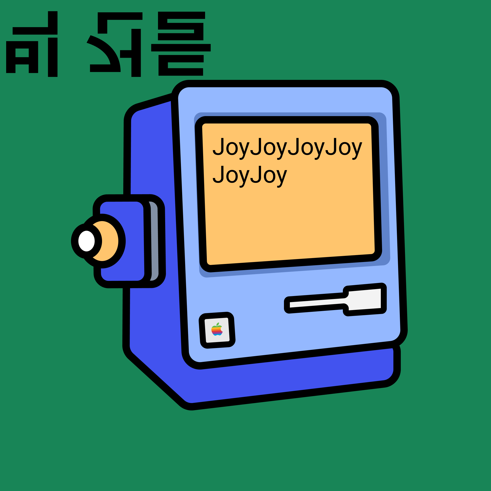
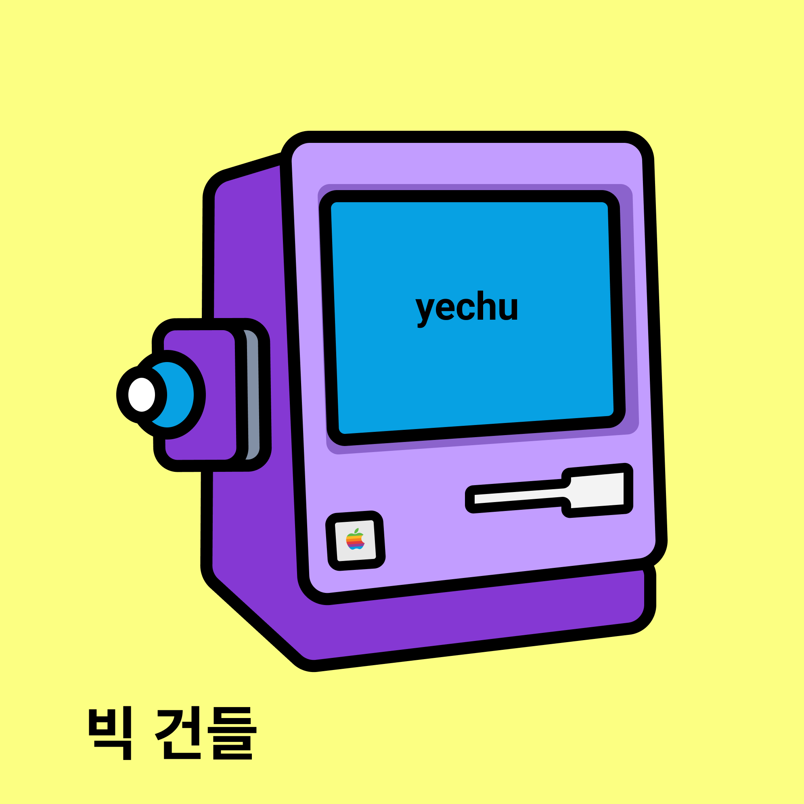
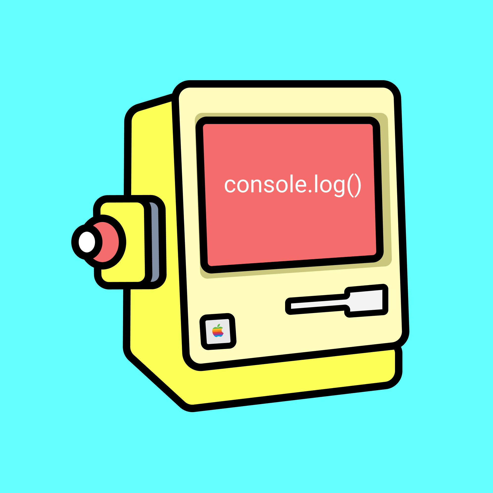

# am0318: 당신에게 주겠상✨
> 테오의 스프린트 5기

<br/>

<div align=center>


</div>

<br/>

## INTRO
```
쑥스러워 숨겼던 마음, 직접 말하기엔 어색했던 마음, 하지만 너무너무 잘했다고 전달하고 싶은 마음.. 뭐든 좋상!
상장과 도장에 마음을 담으면 누군지 아무도 모르게 슝- 주겠상🏆
다들 너무 멋지게 잘하고있으니 오늘도 상장받고 이겨내상 ><
```

- [Gather](https://app.gather.town/app/BF5knX8KBmXFn5CU/teo)
- [Figma](https://www.figma.com/file/gK3CgCDEI2NVTIcbpBmx14/%ED%85%8C%EC%98%A4%EC%9D%98-%EC%8A%A4%ED%94%84%EB%A6%B0%ED%8A%B8-5%EA%B8%B0?node-id=2%3A3)

<br/>

## USAGE
1. [당신에게 주겠상✨](serene-golick-21e934.netlify.app/)에 접속한다.
2. `시작하기` 버튼을 클릭한다.
3. 자신의 애칭을 입력하고 `링크 생성`을 클릭한다.
4. 복사된 URL을 친구와 동료들에게 공유한다👀
    > URL로 접속한 뒤 애칭을 입력하고 상장을 만들어 수여해주세요🥳

5. 시간이 지나고 `상장 콜렉션 보기`를 클릭하여 수여된 상장을 감상한다🤭

<br/>

## TECH STACK
### Common
<p>
  &nbsp
  <br>
</p>

### Frontend
> Netlify 배포

<p>
  &nbsp 
  &nbsp
  <br>
  &nbsp
  &nbsp
  &nbsp
  <br>
  &nbsp
  &nbsp
  &nbsp
  &nbsp 
</p>

### Backend
> Heroku 배포

<p>
  &nbsp 
  &nbsp
  <br>
</p>

<br/>

## CONTRIBUTORS 

<table>
  <tr height="140px">
  <td align="center">
      <a href="https://bit.ly/3LZ2CdR"></a>
      <br />
      <a href="https://bit.ly/3LZ2CdR">노아 🎨</a>
    </td>
    <td align="center">
      <a href="https://github.com/InSeong-So"></a>
      <br />
      <a href="https://github.com/InSeong-So">파랑 💻</a>
    </td>
    <td align="center">
      <a href="https://github.com/areumsheep"></a>
      <br />
      <a href="https://github.com/areumsheep">조이 💻</a>
    </td>
    <td align="center">
      <a href="https://github.com/parksil0"></a>
      <br />
      <a href="https://github.com/parksil0">Seal 💻</a>
    </td>
    <td align="center">
      <a href="https://github.com/wooooooood"></a>
      <br />
      <a href="https://github.com/wooooooood">나무 💻</a>
    </td>
    <td align="center">
      <a href="https://github.com/yechukim"></a>
      <br />
      <a href="https://github.com/yechukim">예츄 💻</a>
    </td>
    <td align="center">
      <a href="https://github.com/sunhwa508"></a>
      <br />
      <a href="https://github.com/sunhwa508">콘솔 💻</a>
    </td>
  </tr>
</table>

## INSTALL & RUN
- install
  ```sh
  yarn install # or yarn
  ```

- run
  ```sh
  yarn dev:back  # backend: server
  yarn dev:front # frontend: client

  yarn dev:start     # bacend-frontend, web start
  ```

- build
  ```sh
  yarn build
  ```

- port kill
  ```sh
  yarn taskkill
  ```

<br>

### Convention

|태그|설명|
|---|----|
|`✒️Feat: `|새로운 기능을 추가할 경우|
|`🛠Fix: `|버그를 고친 경우|
|`✍️Design: `|CSS 등 사용자 UI 디자인 변경|
|`❗️♻️BREAKING CHANGE: `|커다란 API 변경의 경우|
|`❗️✔️HOTFIX: `|급하게 치명적인 버그를 고쳐야하는 경우|
|`🎆Style: `|코드 포맷 변경, 세미 콜론 누락, 코드 수정이 없는 경우|
|`🗃Refactor: `|프로덕션 코드 리팩토링|
|`💬Comment: `|필요한 주석 추가 및 변경|
|`📝Docs: `|문서를 수정한 경우|
|`🧪Test: `|테스트 추가, 테스트 리팩토링(프로덕션 코드 변경 X)|
|`🔬Chore: `|빌드 태스트 업데이트, 패키지 매니저를 설정하는 경우(프로덕션 코드 변경 X)|
|`✂️Rename: `|파일 혹은 폴더명을 수정하거나 옮기는 작업만인 경우|
|`🧺Remove: `|파일을 삭제하는 작업만 수행한 경우|

<br>

## LICENSE

[MIT](https://opensource.org/licenses/MIT)

<br>